# CloudCompareと点群で3Dモデルの作成
航空・地上レーザー測量で取得したポイントクラウドを3Dモデルにする手法を解説します。ポイントクラウドの点と点をつないぐことで、以下のように面を作成できます。学習をはじめる前に、実習用データを入手してください。また、この実習ではマウスを用います。

**Menu**

- ソフトウェア
- 実習用データ
- LAS (.las) 
- 起動と利用設定
- ファイルの読み込み
- 表示
- 点群密度の表示
- 点の間引き
- 処理範囲の抽出
- 2.5D メッシュ化
- 法線の計算
- メッシュの作成
- データの保存
- 練習問題

---------

## ソフトウェア
本実習では、[CloudCompare](https://www.danielgm.net/cc/)を使用する。`Download`内の`Latest stable release`のインストーラーを入手し、インストールする。以下では、Windows環境で、2.13.2 Kharkiv (7/08/2024)を使用している。

CloudCompareの利用例を[高精細地形情報取得のためのオープン教材](https://hdtopography.github.io/learning/book/)で事前に確認しておくと以下の実習がスムーズに行えます。

## 実習用データ
以下では、G空間データセンターにある[石川県「令和 2 年度 森林情報整備事業」成果データ](https://www.geospatial.jp/ckan/dataset/2024-notowest-pcrgb)の`notowest14.zip`のうち`07F02014.las`（輪島市門前町）を実習用データとして使用する。ダウンロード後に、ZIPファイルを展開する。

## LAS (.las) 

- LIDARデータのファイル形式のひとつ(パブリック規格)
- LAZ（.laz）という圧縮形式のファイルもある
- 各ポイントにX、Y、Zなどの位置情報、測量時の反射強度、RGBなどの情報を格納
- バージョンが存在、2019年時点で1.4が最新（ASPRSで承認）

> https://www.asprs.org/divisions-committees/lidar-division/laser-las-file-format-exchange-activities

## 起動と利用設定
インストール後、CloudCompareを起動する。

- DB Tree：各ファイルの選択や表示・非表示ができる
- Properites：各ファイルの詳細情報の参照、3Dビューでの可視化の調整
- 3Dビュー：ファイルが3D表示できる

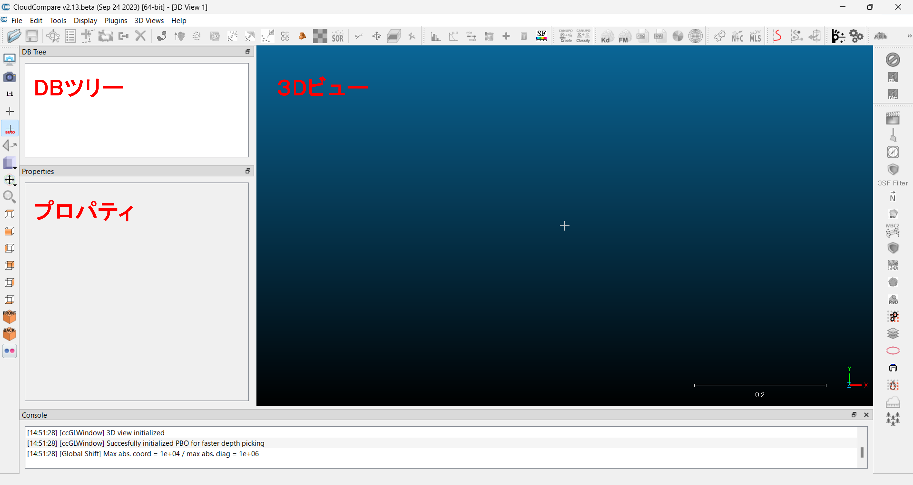

### 言語とスケールバー
言語は、`Display > Language Translation` から選択できる（`No Translation`のままで問題ない）。スケールバーは、`Set current view mode`アイコンから`Orthographic projection`を選択すると表示するモードになる。
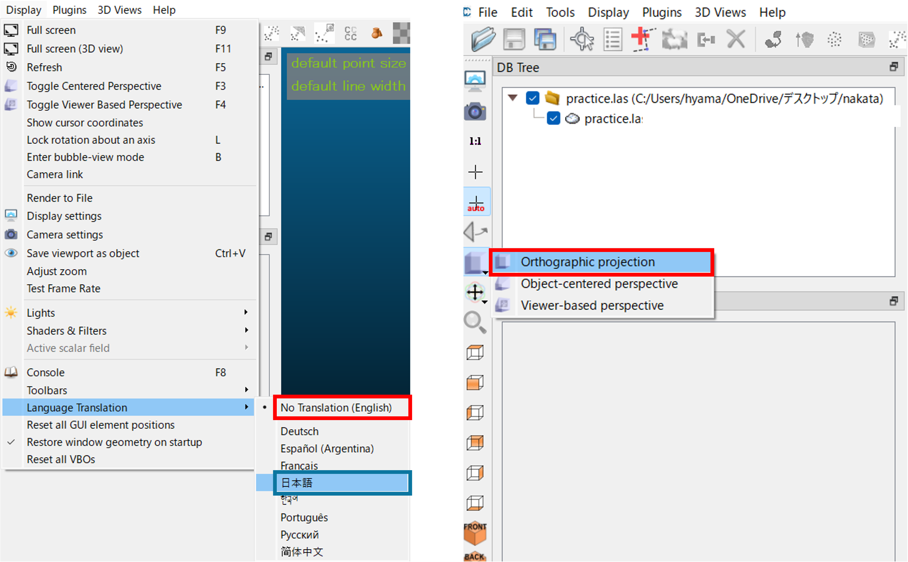

> 不明な点は、ヘルプ内の[wiki](https://www.cloudcompare.org/doc/wiki/index.php/Main_Page)を参照

## ファイルの読み込み
`07F02014.las`を以下のようにドラッグアンドドロップし、`Apply`を選択する。
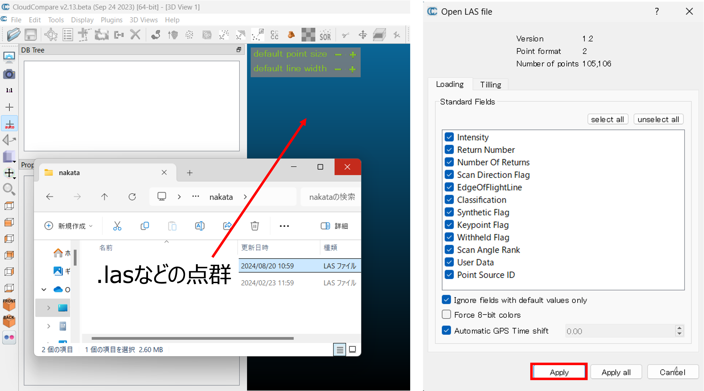

`Global shift / scale`は、`Yes`を選択する。ファイルが読み込めたら、`Properites`から点の数などを確認しておく。
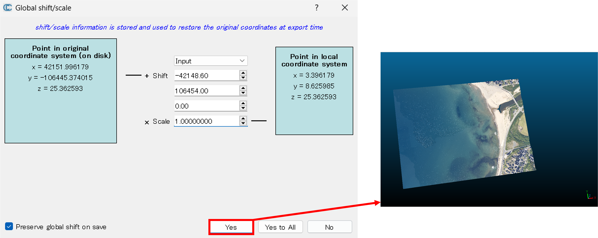

## 表示
アイコンを使用したり、マウス操作で3Dビューの視点を調整できる。

- 左クリック：角度の調整
- 右クリック：移動
- ホイール：ズーム

## 点群密度の表示
`Tools > Other > Compute geometric features`を選択し、デフォルト値のまま、`Volume density`にチェックを入れ`OK`をクリックする。
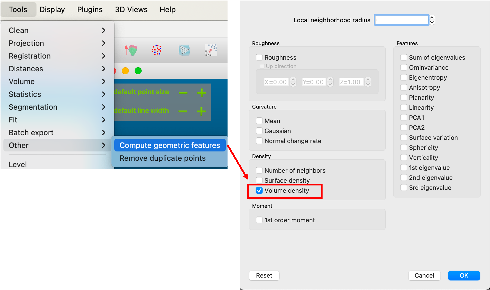

`Properites > CC object`が`Scalar field`になっていることと`Scalar fields`が`Volume density`になっていることを確認し、`Color scale`を調整することで、点群の色分けが設定できる。3Dビューを戻す時は、`Properites > CC object`を`RGBに`する。
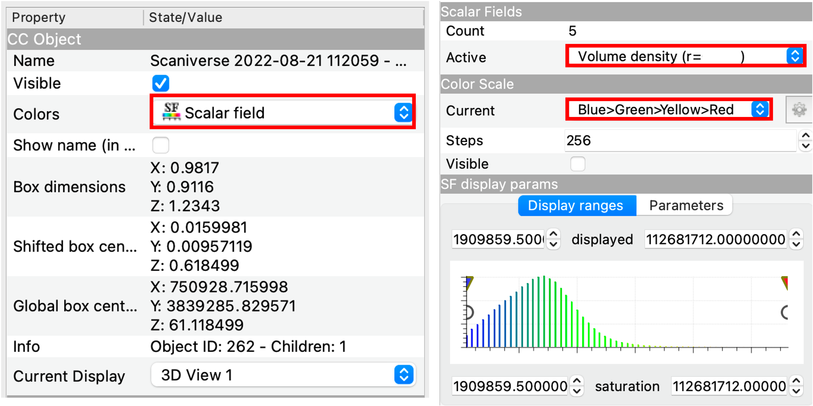

## 点の間引き
`Cloud sub sampling`アイコンをクリックすれば、任意の値を最小値として点群を間引くことができる。今回は、0.1（10cm）としたが、データによって最適な値を設定する必要がある。
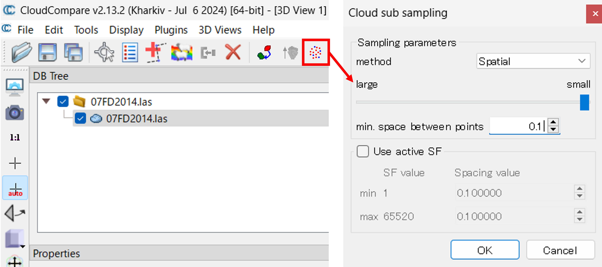

## 処理範囲の抽出
次の手順で、今回処理する範囲を抽出する。

1. `Polygonal selection`を選択 
2. 自由領域を作成、最後に右クリックする
3. セグメントインで抽出
4. 切り出しか、上書きが選択できるが、今回は右から2番目のアイコンを押して上書きする

## 2.5D メッシュ化
`Edit > Mesh > Delaunay 2.5D (XY plane)`を実行すると、簡易的なメッシュができる。生成したモデルを確認すると、現実ではオーバーハングしている箇所がうまく反映できていないことがわかる（平坦な裸地の点群データであれば、この手法でも十分に現実を再現できる）。
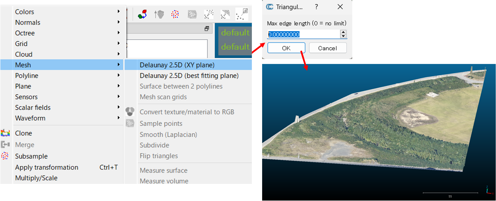

## 法線の計算
3Dメッシュを作成するために、法線を計算する。`Edit > Normals > Compute`をクリックする。次に、`Surface approximation > Triangulation`を選択する。目安として、Planeはノイズに強くてエッジに弱い、Triangulationはノイズに弱くてエッジに強い、Quadricは曲面に強いといった特徴がある。`Use Minimum Spanning Tree`について、今回は`knn = 6`で実行する。本来は点群の質によって調整する必要がある。

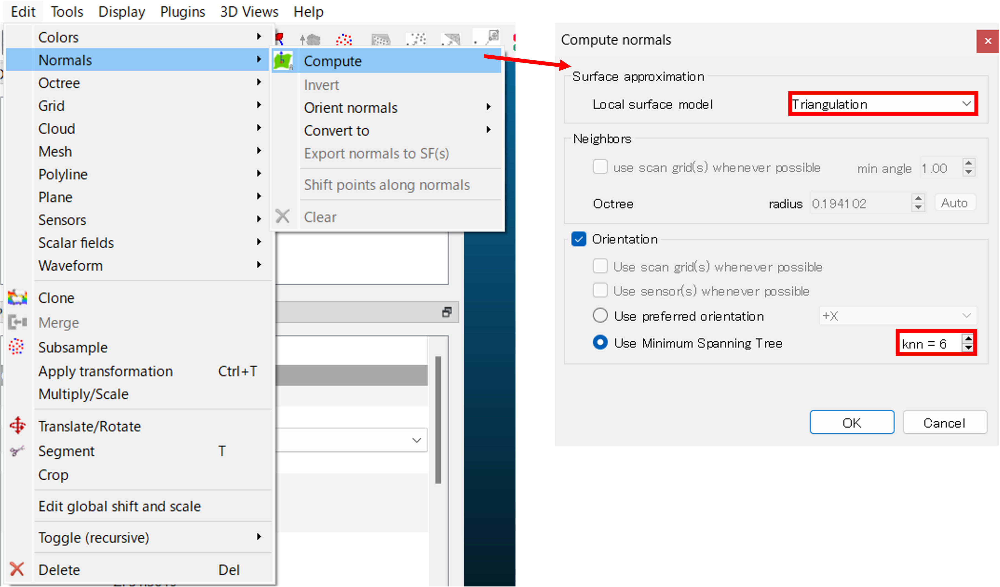
※ 法線の方向は、`Properites`で可視化できる。

## メッシュの作成
`Plugins > PoissonRecon`を選択する。今回は、`Octree depth`を`8`とする。`Octree depth`では、ボクセル（立方体）をその段階まで分割するかを設定する。一般的には、7〜9の間で設定する。次に、`Advanced`の`boundary > Dirichlet`にして実行する。boundaryのうち、Freeは境界を自由な形状にする、Dirichletは境界を固定にする、Neumannは境界部を連続的にする設定である。
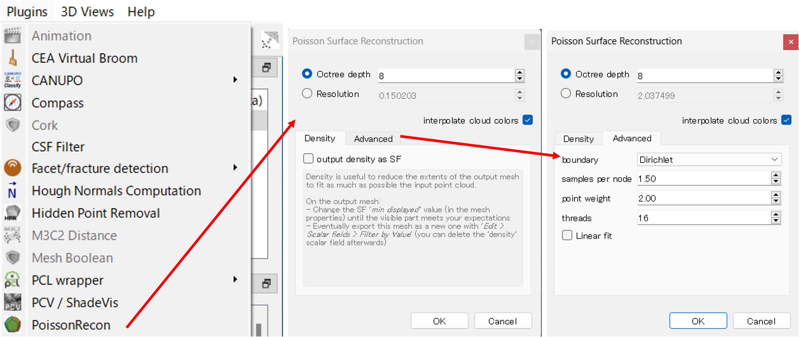

## データの保存
DB Tree上で作成したMeshを選択して、`Save current entity`のアイコンをクリックし、モデル.plyで保存する。保存したファイルは別のソフトウェアでも表示できる。
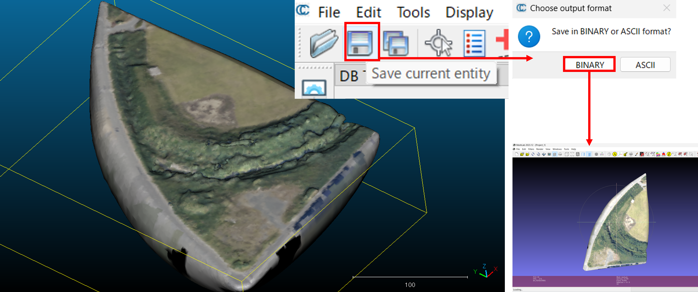

