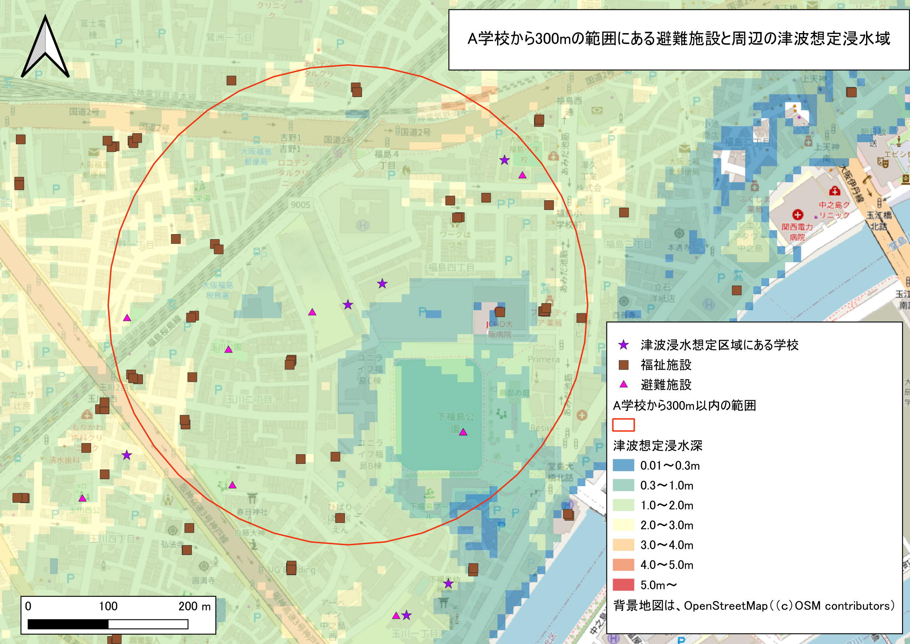
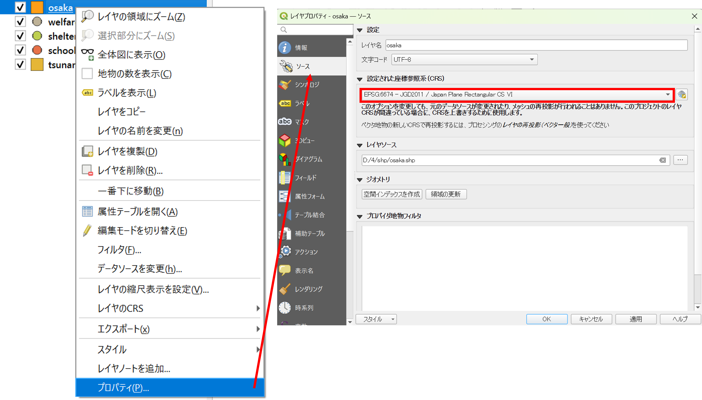
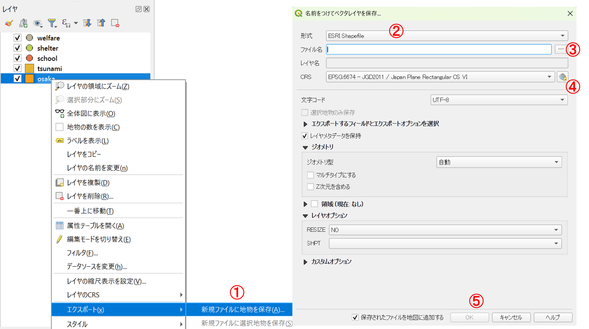
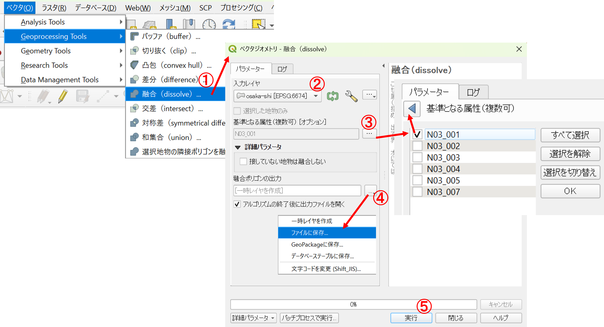
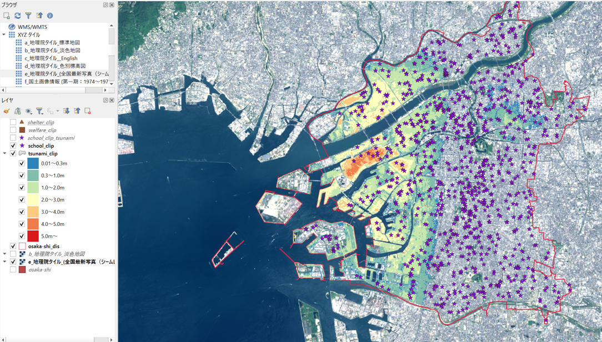
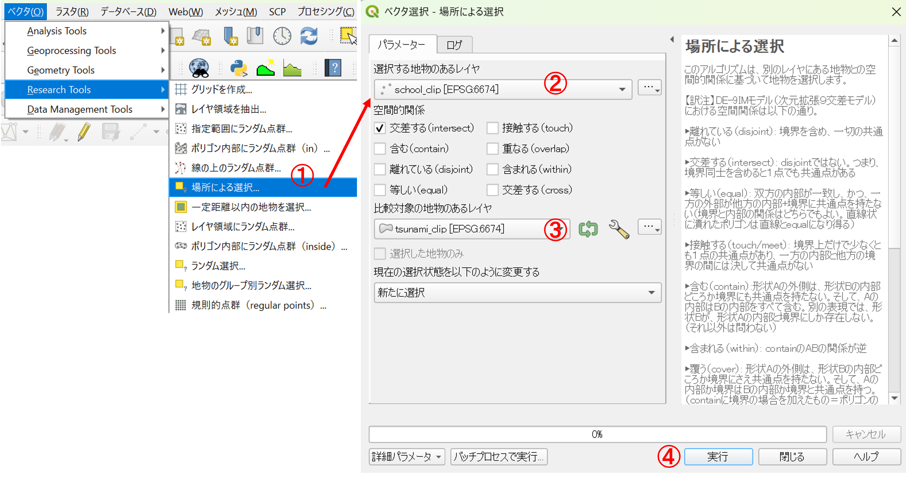
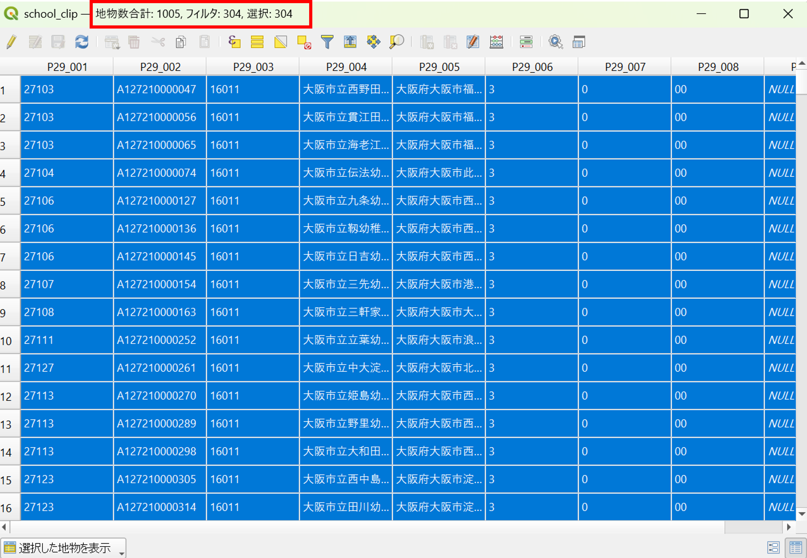
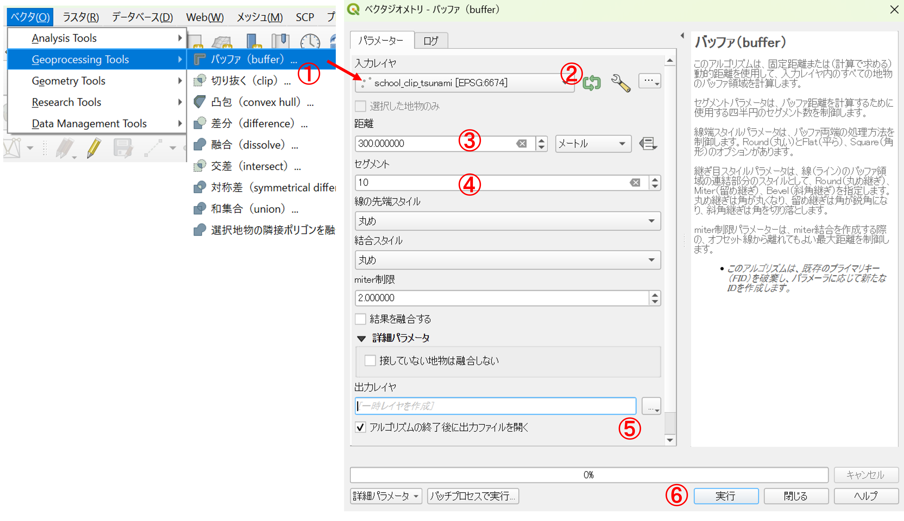

# 災害情報を活用した地図作成と分析
大阪市に到達する津波の浸水想定域に含まれる学校がわかる地図の作成を通じて、以下の内容を学習する。

- 対象地域の抽出（選択とクリップ）
- 属性検索と空間検索
- バッファの作成
- 地物の重なりを用いた点データの集計

### 作成した地図を用いた授業例
大阪市を対象に津波の危険性の高い地域にある学校を可視化・集計し、浸水想定区域内でも避難所が周辺に多数ある学校を抽出する。最終的には、GISで作成した以下のような地図を用いて避難所の実態や立地環境を調査するフィールドワークの実施を想定する。なお、教科の内容・進め方で対象者を変えられるため、対象学年は限定しない。

## 0. 基礎知識・スキル
- [GISの基本概念](https://gis-oer.github.io/gitbook/book/materials/00/00.html)
- [QGISの基本操作](https://gis-oer.github.io/gitbook/book/materials/QGIS/QGIS.html)
- [データのダウンロード](https://gis-oer.github.io/gitbook/book/materials/07/07.html)
- [空間座標の変換](https://gis-oer.github.io/gitbook/book/materials/08/08.html)

## 1. データの収集
以下のデータを国土数値情報などから入手してください。対象地域は大阪市・最新のデータとします。ダウンロードしたデータは.zipを展開した後、一つのフォルダにまとめてください。この際、.shpのみを移動せず、すべてのファイルを移動するようにしてください（シェープファイルは、複数で一つのファイルです。）。

- 国土数値情報：避難施設（ポイント） ※今回は練習のため対応災害の種類を考慮せず使用する
- 国土数値情報：津波浸水想定（ポリゴン）
- 国土数値情報：行政区域（ポリゴン）
- 国土数値情報：福祉施設（ポイント）
- 国土数値情報：学校（ポイント）
- この他に、QGISのブラウザパネルから地理院タイル（標準地図）などを表示できるようにしておく。

## 2. 空間座標系の変換
入手したファイルをQGISに読み込み`EPSG:6674（JGD2011 / Japan Plane Rectangular CS Ⅵ）`次の手順で座標系を整える。

 各レイヤの`プロパティ＞ソース`を開き、`設定されたCRS`にある現在の座標系を確認する

QGISの右下のEPSGコードを確認する。今回の場合は、地理座標系のJGD2011のEPSGコードである`6668`となっている。

各レイヤの座標系を統一するために、以下の操作を行う。

1. `プロパティ＞エクスポート＞新規ファイルに地物を保存`を選択する
2. `形式`を`ESRI Shapefile`とする
3. 新規に書き出すファイル名を指定する
4. `座標参照系（CRS）`のアイコンから`EPSG:6674`を検索して指定する
5. `OK`を実行して、データを書き出す

同じ作業を他のファイルにも行う。レイヤパネルにある不要なファイルを削除する。

QGISの右下のEPSGコードを`6674`に変更する。

## 3. 対象地域の作成（選択とディゾルブ）

### 大阪市の抽出
大阪府の行政区域のレイヤの`属性テーブル`を開き、`式による地物の選択`をクリックする。` "N03_004" ='大阪市'`を入力し、`地物の選択`をクリックする。

選択は属性テーブルからでも地図からでもできるが、選択したものはハイライトされる（属性テーブルでは青、地図では黄色になる）。属性テーブルでは、左図のように選択した地物のみを表示することもできる。選択状態の解除は右図の青枠のアイコンから行う。

次に、選択した地物のみを出力する。この際に`選択地物のみ保存`にチェックが入っているかを確認する。

以下のように、区の境界による次の処理のエラーがないように、ディゾルブ（同一の属性情報を用いて境界を融合する）によって大阪市のみの単純なポリゴンを作成する。今回は、`N03_001`を使用するため、事前にこの属性テーブルに何が入っているかを確認しておくと良い。

1. `ベクタ > Geoprocessing Tools > 融合 (dissolve)`をクリック
2. 入力レイヤを指定する
3. 基準となる属性を`N03_001`とする
4. `ファイルに保存`を指定、出力レイヤを指定する
5. `実行`をクリック

## 4. データの抽出（クリップ）
ディゾルブしたレイヤを用いて、他のレイヤをクリップ（レイヤの重なりによる抽出）を実行する。

1. `ベクタ > Geoprocessing Tools > 切り抜く (clip)`をクリック
2. 入力レイヤを切り抜きたいレイヤにする
3. オーバーレイヤをディゾルブしたポリゴンにする
4. 出力レイヤを指定する
5. `実行`をクリック

他のレイヤもクリップし、不要なものは削除する。次の段階に進む前に、各レイヤのスタイルをシンボロジーから設定しておく。

## 5. 浸水想定区域と重なる学校数の集計と抽出
まず、浸水想定区域と重なる学校を選択する。

1. `ベクタ > Research Tools > 場所による選択`をクリック
2. `選択する地物のあるレイヤ`を指定（ここでは学校）
3. `比較対象の地物のあるレイヤ`を指定
4. `実行`をクリック

選択した状態で属性テーブルを開くと、ウィンドウの上部に選択した地物の数が表示されていることを確認する。

次の段階で使用するため、選択した学校は、３の手順で別のレイヤとして出力する。

## 6. 学校周辺の避難所の数を集計
周辺に避難所の多い学校を特定するため、学校から300mの範囲（バッファ）を作成する。

1. `ベクタ > Geoprocessing Tools > バッファ(buffer)`をクリック
2. 入力レイヤを前段階で出力したレイヤにする
3. 距離を300とする
4. セグメントを10とする（滑らかなポリゴンにする）
5. 出力レイヤを指定する
6. `実行`をクリック

作成したバッファを用いて、以下のように周辺の避難所の数を算出する。

1. `ベクタ > Analysis Tools > ポリゴン内の点の数`
2. 作成したバッファのポリゴンを指定
3. 避難所の点データを指定
4. 出力レイヤを指定
5. `実行`をクリック

属性テーブルを開くと`NUMPOINTS`というフィールド（緑枠）が追加されており、ポリゴン内の避難所の数が記載されていることを確認する。300m以内に6つ以上避難所がある学校を選択し、赤枠内のアイコンを押して、地図を表示する。この際に、避難施設の位置が近いと地図上では重なってみえる点に注意すると良い。

## 課題
次のいずれかの課題を実施し、**縮尺、凡例、方位記号、タイトル**をつけて、レイアウトした地図を次回の授業までにmanabaから提出してください。課題①の提出ファイルの形式は、**PNG**または**PDF**、課題②は**PDF**とします。

### 課題①
本教材の冒頭で示した地図のように授業例と対応した地図を作成してください。以下を条件とします。

- 作成する地域は、300m以内に避難施設が6つある学校
- 背景地図は地理院タイルからフィールドワークに適したものを選択する
- タイトルはA学校ではなく、正式な学校名にする

### 課題②
今回使用したレイヤを用いた授業案を作成するとともに、それと対応した地図も作成して提出してください。両方合わせても、A4で2枚以内でまとめてください。

