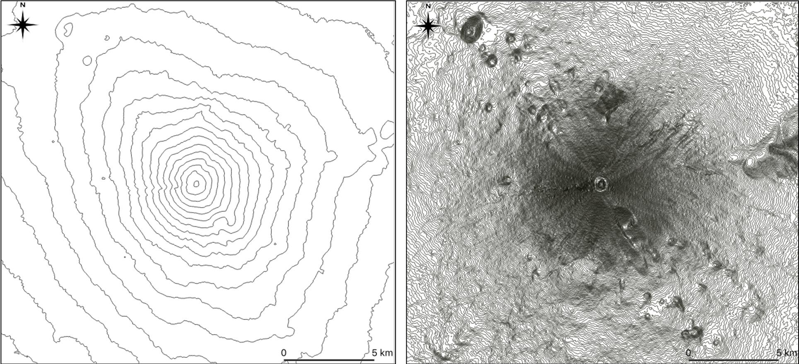

# 地図の基礎
　この教材は、地形学習の基礎となる地図の基本を解説します。前半では地図の基礎知識を解説し、後半では等高線の読み取りについて解説します。等高線の読み取りでは、GISで三次元で等高線を閲覧できます。

- [地図](#地図)
- [地図の活用](#地図の活用)

## 地図
　地図は、現実の空間を縮尺によって変形させ、記号等を用いて抽象化した地物を平面に図化したものです。国や街の範囲、主要道路や海路、山脈、人口の分布、災害の予測範囲を示したりと様々な用途で使用されています。
　
### 地図の種類
地図には、国土等の基本情報のみを示した**一般図**と、特定のテーマをもつ**主題図**があります。一般図には、国土地理院が発行する地形図のようなものがあります。主題図には、気温の分布図、観光マップ、土地利用図等があります。一般図は、主題図の背景として組み合わせて利用することもあります。ここで、余裕のある方は、インターネットで地形図とハザードマップを検索し、それぞれの違いを確認していましょう。

### 各図法の特徴と課題
地図は、楕円体の地球を平面に描くため（投影するため）、平面にすると歪みが生じます。これまでに、角度の正しい図、面積の正しい図、距離と方位の正しい図が考案され、目的に応じて使用されてきました。各図にはメリット、デメリットがあるため、世界地図などの地図を見る際には、注意が必要です。各図法の特徴と課題を、以下の図と表で確認してください。

**代表的な図法**

> 上記の図は、[Mercator_projection_Square.jpeg, Mollweide_projection_SW, Azimuthal_equidistant_projection_SW © Strebe CC BY-SA 3.0](https://en.wikipedia.org/wiki/List_of_map_projections)を利用し作成

**各図法とその特徴**

||代表的な図法|特徴|
|:---|:---|:---|
|正角図法|メルカトル図法|・角度が正しい、緯度経度による比較が容易  ・赤道から離れるほど実際よりも拡大|
|正積図法|サンソン図法 モルワイデ図法|・面積が正しい ・高緯度の地域の視認性が低下|
|正距方位図法||・距離と方位が正しい ・端ほど歪みが大きい|

####　その他の投影法が比較、閲覧できるサイト
地図の投影法をGIS等で比較、閲覧できるサイトとして以下があります。関心のある方は、参照してください。

- 画像で表示:[wikimedia List of map projections](https://en.wikipedia.org/wiki/List_of_map_projections)
- アプリケーションで各図法を表示:[D3 MapMaker](http://techslides.com/demos/d3/map-maker/)
- メルカトル図法を比較:[The True Size Of ...](https://thetruesize.com)
- 正距方位図法で距離を比較:[どこでも方位図法](http://maps.ontarget.cc/azmap/)

## 地図の活用
　地図は、地域の範囲やその地域の地物を把握したり、複数の地域を比較する際に用いられ、用途によって使い分けられます。ここでは、地形図の基本と等高線の読み取り手法について、GISを利用しながら解説します。

### 地形図の基本と等高線の読み取り
地形図は、地形、河川、道路、建物などの国土の基本情報を示した図です。地形は等高線で、施設や土地利用は地図記号で示されます。代表的な施設の名称や、基準点の標高も示されています。5万分の1や2万5千分の1の縮尺で作成され、主題図のベースマップとして利用されることもあります。従来、地形図は紙媒体で利用されていましたが、最近では電子媒体（WebGIS）としてオンラインでも利用できます。WebGISは、次の地理情報で詳しく解説します。地図記号の詳細は、[国土地理院の地図記号一覧](https://www.gsi.go.jp/KIDS/map-sign-tizukigou-h14kigou-itiran.htm)から確認できます。この教材では、地形の理解の基礎となる等高線の読み取り手法を解説します。

<iframe width="700" height="510" src="https://gg-oer.github.io/maps/leaflet/2-m1.html" frameborder="0" allow="accelerometer; autoplay; encrypted-media; gyroscope; picture-in-picture" allowfullscreen></iframe>

### 等高線
等高線は、同じ高さの標高を線で結んで地形を表現したものです。等高線があることで、標高の違い、尾根や谷の形、地形の起伏等を理解できます。次の図は、富士山の等高線ですが、右の図のように密度を高くすることで、等高線が実際の地形を表現していることがわかります。※等高線の密度が高い地形の細部が読み取りやすい一方で、標高値が近い2点間の値の違いが読みとりづらくなります。また、その他の地物（建物や道路等）とともに描画すると、地図自体が読み取りづらくなります。地図を作成する場合は、適切な密度の等高線を設定する必要があります。国土地理院の発行する２万５千分の１地形図では、10mごとの計曲線、50mごとの主曲線、部分的に用いられる2.5mの補助曲線で地形を表現しています。

*等高線による地形表現*

#### 演習①　等高線の読み取り
次の地図の地点A、B、C、Dを標高の高い順に並び替えてみましょう。標高の違いを把握した後に、尾根に位置する点と谷に位置する点をわけてみましょう。

<iframe width="700" height="510" src="https://gg-oer.github.io/maps/leaflet/2-m2.html" frameborder="0" allow="accelerometer; autoplay; encrypted-media; gyroscope; picture-in-picture" allowfullscreen></iframe>

まず、標高の違いですが、**(高)C→A→D→B(低)**となります。等高線の形状から、AとCが尾根に、BとDが谷に位置していることがわかります。ここで、標高の違いを踏まえると表2のように、各点を整理することができます。

表2 地形の特徴

|地点|特徴|
|---|---|
|A|2番目に高く、尾根に位置している|
|B|最も低く、谷に位置している|
|C|最も高く、尾根に位置している|
|D|3番目に高く、谷に位置している|

### 演習②　写真の撮影方向から景観を考える
地形図で地形が把握できれば、その場所からどのような写真がとれるかが想像できます。次の写真は上の地図のA~D地点のいずれかから北方向を撮影したものです。カメラを水平に据えたものとして、この写真がどの地点で撮影したものか考えてみましょう。

*A~Dのいずれかから北方向を撮影した写真*

まず、谷に位置する地点Bと地点Dでは、北方向を撮影した場合、正面には上り坂が写るはずです。このことから、AとDに絞られますが、正解はAとなります。Aの場合では、B地点のある谷を挟んで正面に周囲よりも緩やかな斜面が広がっているのが地形図から読み取れます。Dの場合だと写真の左側に登山道のある尾根が映るはずで、正面の景観（東側）には下り方向の急傾斜が広がります。 
　さらに、上の地図右上のボタンで、写真をクリックすれば、周辺の大まかな植生や岩石の露出していることを確認できます。地理情報システムを利用することで、写真以外にも様々な情報を重ね合わせることができ、解析機能をあわせて利用することで、より深く地域を理解することができます。次章では、地理情報システムについて解説します。

## ３Dで確認
地理情報を効果的に組み合わせることで、地形が読み取りやすくなります。下の地図を操作して、演習1と演習2を確認しましょう。

<iframe width="700" height="510" src="https://gg-oer.github.io/maps/cesium/cntr.html" frameborder="0" allow="accelerometer; autoplay; encrypted-media; gyroscope; picture-in-picture" allowfullscreen></iframe>

[地図のみ表示：スマホユーザー向け](https://gg-oer.github.io/maps/cesium/cntr.html)

#### データソース
本教材で利用したデータは、[Resources]()に別途まとめています。運用者が自作したデータは、無償でダウンロードできます。
