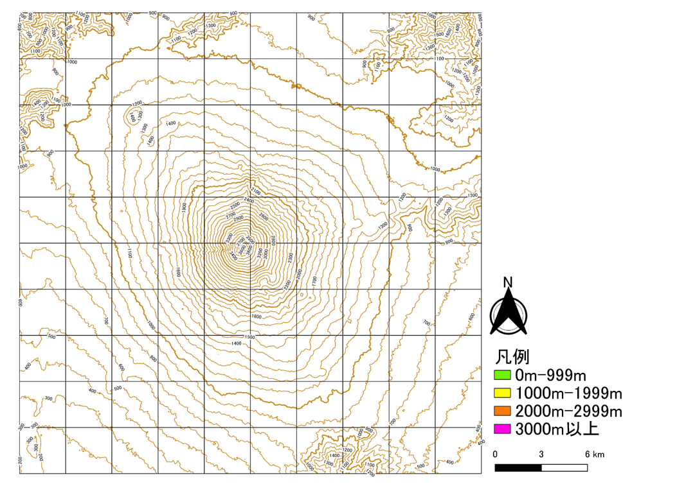
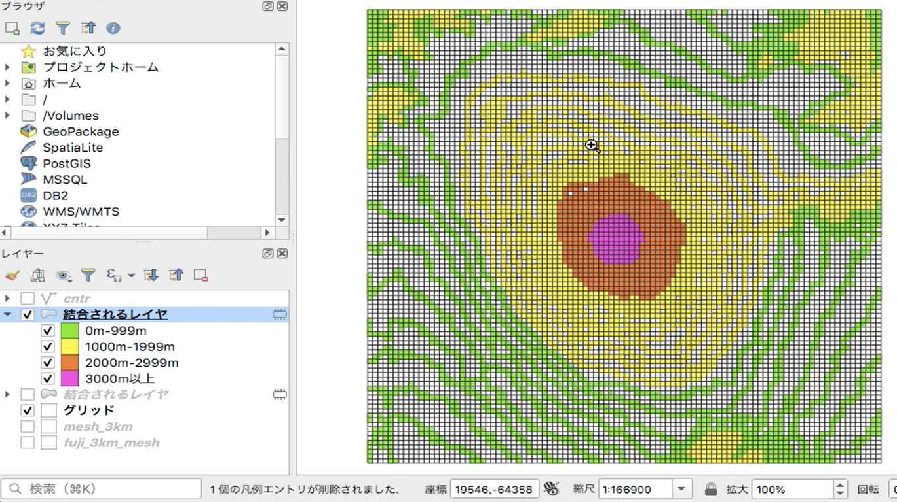
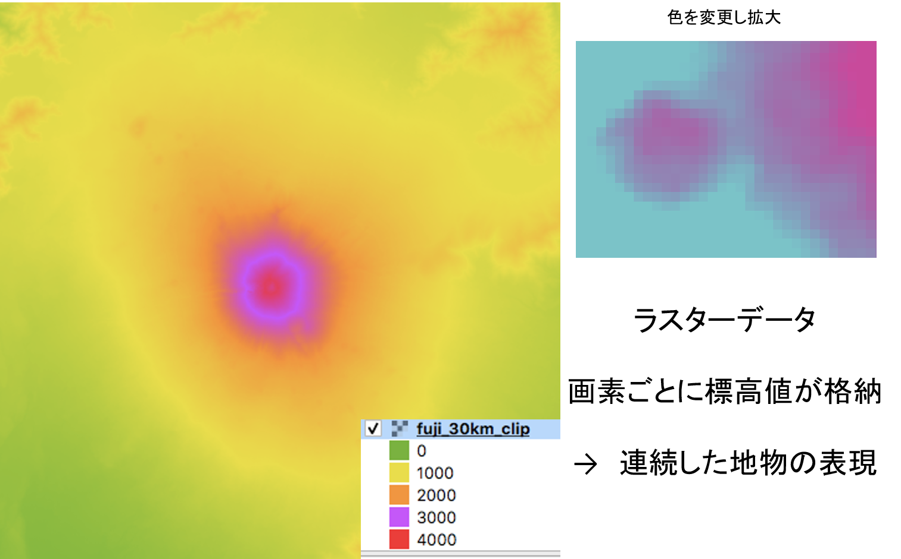
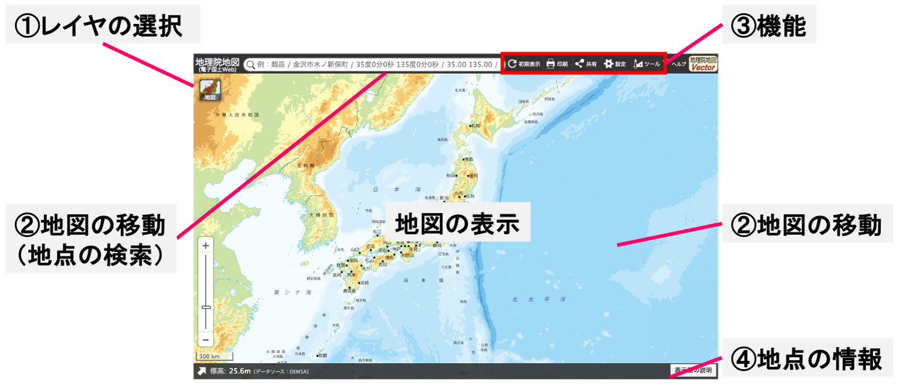
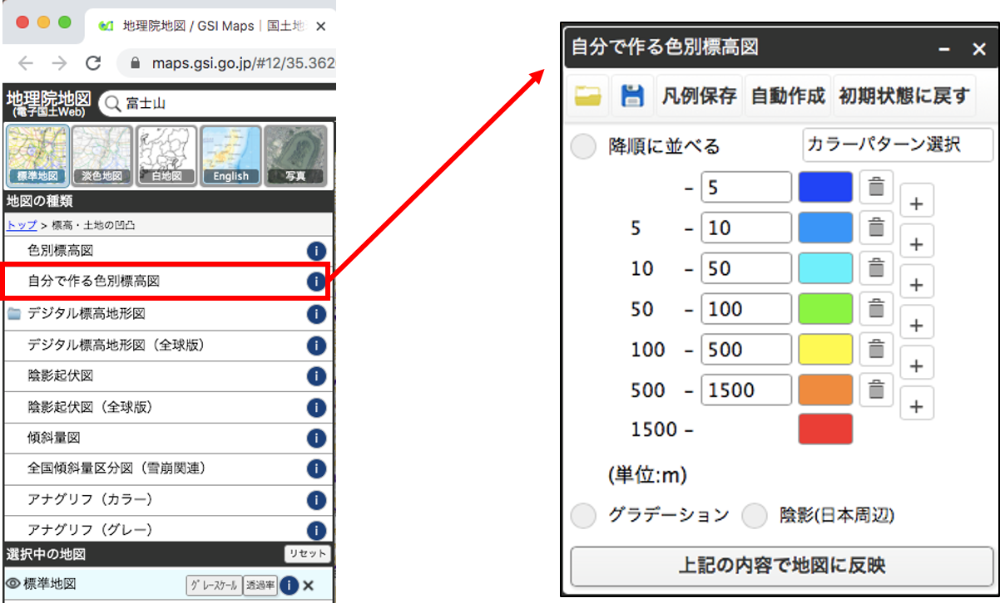
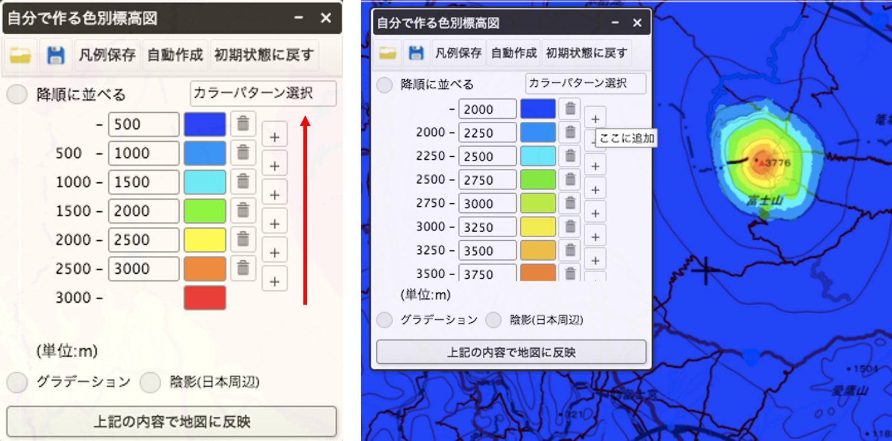
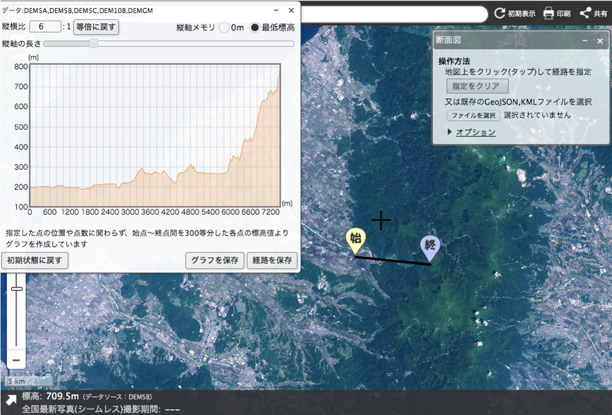

# 紙地図とGISの違いを学ぶ
この演習では、紙地図とGISの違いとして、GISのメリット、地物の捉え方を学びます。レイヤの切り替えによる地理的認識の向上は、別の教材で解説しています。

演習を開始する前に、[実習用地図](./dataset/t1_p1.png)を印刷し、色鉛筆を用意してください。実習用地図は、富士山の周辺を示しています。

## 等高線の読み取り

以下の地図の等高線は100m間隔で、内側ほど高い標高を示します(山頂付近は火口のため例外)。また、1000m間隔で太い線になっています。地図全体が3kmの正方形の区画で分けられています（100区画）。各区画の最も大きい標高値をよみとり、凡例に従って区画を塗り分け（区画を塗りつぶす）てみましょう。10分間を目安にできる範囲で各区画を塗分けてみましょう。

この作業をすると[回答例](./img/t1_2.png)のような地図ができ、この区画が小さいほど詳細な地形を示すこともわかると思います。

## GISでの分析
紙地図の作業では、目視で区画内の等高線を数えたり、標高の値を確認したりしました。では次に、各区画を300mの正方形として、同じ作業をすることを想像してください。時間はたくさんかかりますが、より細かく地形の色分けができると考えると思います。また、GISを使うことで最大値のみでなく、最小値や平均値も計算できます。高速でデータを処理できるGISを使って、人間と同じ方法で情報を算出します。そうすると下の図のような結果になります。

これは、300mの区画にすると等高線が重ならない範囲が生じるため、色分けが空白の区画ができます。人間であれば、等高線の間隔の違いから標高の高さが読み取れますので、２本の等高線の間値をなんとなく割り当てて、塗分けできます。

> 上記は等高線の数を増やしたり、間の標高を位置関係から算出（補間）する方法でも解決できますが、ここでは紹介しません。

つまり、線の形状で地形を表すことは、人間の視覚には有効ですが、今回のような目的では良い方法ではありません。地形のような隙間なく面的に広がる地物には、それに適したデータの形式があります。地形は、以下のようなラスタ形式のデータで表されることが一般的です。これを用いて、最初のような区画の値を計算することができます。地物の特徴やどのような視点でデータを見るかによってデータ形式の適切さが異なる点に注意が必要です。

※このデータは、30m×30mの区画ごとに標高値をもつ。区画の大きさは解像度ともよばれ、高解像度なデータほどデータ量が重く、高精細な情報を示す。

## ここまでのまとめ
- 人間とGISでは地物の認識の仕方が異なる（GISの特徴を理解していないと情報を誤認する）
- GISなら、簡単に地図を塗分けられる
- GISでは、区画の変更や複数の値の集計が容易
- 区画を小さくすれば、もっと細かい地形がわかる
- 地形のように連続した地物には適したデータ形式がある

## 地理院地図での地形データの表示
　[地理院地図](https://maps.gsi.go.jp/)は、地図や空中写真等の地理情報を無償で閲覧できる国土地理院の高機能なWebGISです。地理院地図にアクセスしましょう。

地理院地図では、①　レイヤ（地理情報）の選択（空中写真や基準点等の表示）、②　地図の移動（住所検索、マウス操作による移動）、③　機能（地物の計測、2画面表示、データ作成等）、④　カーソル位置の標高や緯度経度等の表示等ができますが、ここでは、標高段彩図の作成と地形断面図の作成を体験します。

サイドバーを開き、`標高・土地の凹凸＞自分で作る色別標高図`をクリックして、下のウィンドウを表示しましょう。

次に下の左の図のように値を設定し、`上記の内容で地図に反映`をクリックしてみましょう。最初は、下から値を設定するとわかりやすいです。その後、任意の値を設定してみましょう。

次に`ツール＞断面図`から、任意の2点間の断面図を作成してみましょう。断面図から地形の情報を読み取る際は、縦横比の違いに注意してください。断面図作成の紙地図作業との違いを比較したい方は、[実習用地図2](t1_p2.md)をご利用ください。

## 練習問題:東京の標高段彩図と地形断面図の作成

1. 0mよりも低いエリアとそれよりも高いエリアを分けてみましょう。
2. 東京低地を東西横断する地形の断面を作成してみましょう。
3. 1と2を踏まえて東京低地の洪水時の危険性を考えてみましょう。
